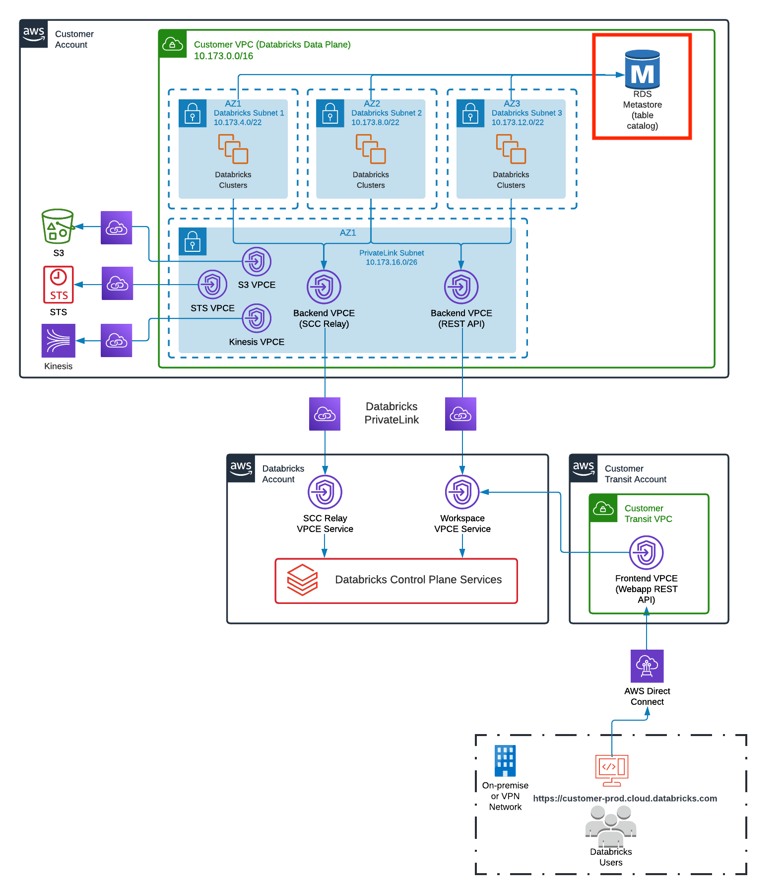

External metastore pattern with AWS RDS

This reference architecture can be described as the following diagram:

#### Modules

No modules.

#### Resources

| Name | Type |
|------|------|
| [aws_db_instance.this](https://registry.terraform.io/providers/hashicorp/aws/latest/docs/resources/db_instance) | resource |
| [aws_db_subnet_group.this](https://registry.terraform.io/providers/hashicorp/aws/latest/docs/resources/db_subnet_group) | resource |
| [databricks_cluster.this](https://registry.terraform.io/providers/databrickslabs/databricks/latest/docs/resources/cluster) | resource |
| [databricks_cluster_policy.this](https://registry.terraform.io/providers/databrickslabs/databricks/latest/docs/resources/cluster_policy) | resource |
| [databricks_dbfs_file.this](https://registry.terraform.io/providers/databrickslabs/databricks/latest/docs/resources/dbfs_file) | resource |
| [databricks_global_init_script.metastore](https://registry.terraform.io/providers/databrickslabs/databricks/latest/docs/resources/global_init_script) | resource |
| [databricks_job.this](https://registry.terraform.io/providers/databrickslabs/databricks/latest/docs/resources/job) | resource |
| [databricks_notebook.metastore_setup](https://registry.terraform.io/providers/databrickslabs/databricks/latest/docs/resources/notebook) | resource |
| [databricks_permissions.can_use_cluster_policyinstance_profile](https://registry.terraform.io/providers/databrickslabs/databricks/latest/docs/resources/permissions) | resource |
| [databricks_secret.hms_conn](https://registry.terraform.io/providers/databrickslabs/databricks/latest/docs/resources/secret) | resource |
| [databricks_secret.hms_pword](https://registry.terraform.io/providers/databrickslabs/databricks/latest/docs/resources/secret) | resource |
| [databricks_secret.hms_user](https://registry.terraform.io/providers/databrickslabs/databricks/latest/docs/resources/secret) | resource |
| [databricks_secret_acl.admin_acl](https://registry.terraform.io/providers/databrickslabs/databricks/latest/docs/resources/secret_acl) | resource |
| [databricks_secret_acl.user_acl](https://registry.terraform.io/providers/databrickslabs/databricks/latest/docs/resources/secret_acl) | resource |
| [databricks_secret_scope.this](https://registry.terraform.io/providers/databrickslabs/databricks/latest/docs/resources/secret_scope) | resource |
| [databricks_token.this](https://registry.terraform.io/providers/databrickslabs/databricks/latest/docs/resources/token) | resource |
| [null_resource.download_metastore_lib_hadoop](https://registry.terraform.io/providers/hashicorp/null/latest/docs/resources/resource) | resource |
| [null_resource.download_metastore_lib_hive](https://registry.terraform.io/providers/hashicorp/null/latest/docs/resources/resource) | resource |
| [null_resource.download_metastore_lib_mariadb](https://registry.terraform.io/providers/hashicorp/null/latest/docs/resources/resource) | resource |
| [null_resource.exec_metastore_init](https://registry.terraform.io/providers/hashicorp/null/latest/docs/resources/resource) | resource |
| [random_password.password](https://registry.terraform.io/providers/hashicorp/random/latest/docs/resources/password) | resource |
| [random_string.naming](https://registry.terraform.io/providers/hashicorp/random/latest/docs/resources/string) | resource |
| [aws_security_group.this](https://registry.terraform.io/providers/hashicorp/aws/latest/docs/data-sources/security_group) | data source |
| [aws_subnets.private](https://registry.terraform.io/providers/hashicorp/aws/latest/docs/data-sources/subnets) | data source |
| [databricks_current_user.me](https://registry.terraform.io/providers/databrickslabs/databricks/latest/docs/data-sources/current_user) | data source |
| [databricks_spark_version.latest_lts](https://registry.terraform.io/providers/databrickslabs/databricks/latest/docs/data-sources/spark_version) | data source |

#### Inputs

| Name | Description | Type | Default |
|------|-------------|------|---------|
|  [databricks_workspace_password](#input_databricks_workspace_password) | n/a | `string` | `"Password associated with databricks_workspace_username"` |
|  [databricks_workspace_url](#input_databricks_workspace_url) | URI: https://<workspace-name>.staging.cloud.databricks.com | `any` | n/a |
|  [databricks_workspace_username](#input_databricks_workspace_username) | Username for authentication to the workspace | `any` | n/a |
|  [dbfs_lib_location](#input_dbfs_lib_location) | DBFS location to collect uploaded libraries | `string` | `"/databricks/metastore-init"` |
|  [hadoop_version](#input_hadoop_version) | Version of Hive to use | `string` | `"2.9.2"` |
|  [hive_database](#input_hive_database) | Name of HMS database to create | `string` | `"metastore"` |
|  [hive_lib_version](#input_hive_lib_version) | Version of Hive libraries to use for metastore setup only; should always be 3.1.0+ | `string` | `"3.1.3"` |
|  [hive_user](#input_hive_user) | HMS connection user | `string` | `"metastore"` |
|  [hive_version](#input_hive_version) | Version of Hive to use in the metastore; 2.3.9 | `string` | `"2.3.9"` |
|  [project_name](#input_project_name) | workspace name | `string` | `"dev-privatelink"` |
|  [region](#input_region) | n/a | `string` | `"us-east-1"` |
|  [tags](#input_tags) | n/a | `map` | <pre>{   "Owner": "someone@databricks.com",   "Project": "dev" }</pre> |
|  [vpc_id](#input_vpc_id) | VPC ID the workspaces is deployed in; used to associate subnets with the new RDS instance | `any` | n/a |
  
RDS info:
- connection endpoint
- username
- password

#### Outputs

| Name | Description |
|------|-------------|
|  [rds_metastore_address](#output_rds_metastore_address) | n/a |
|  [rds_metastore_password](#output_rds_metastore_password) | n/a |
